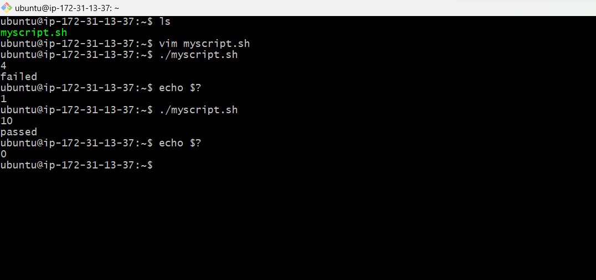
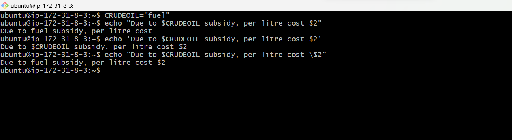
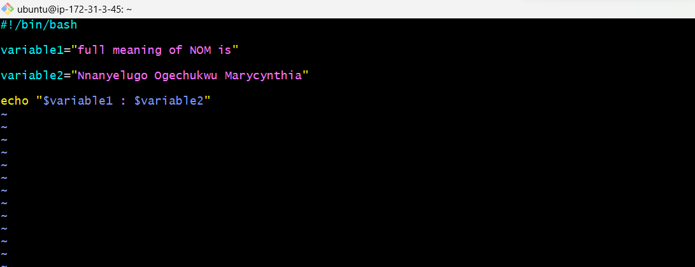

# shell-scripting-project

## what is shell?

shell is  a tool to execute commands.

A shell is a program that act as the interface between you and the linux system, allowing you to enter a commands for the operating system to execute.
 

__types of shells:__

_The Bourne shell_ (sh)

_The C Shell_ (csh)

_The Korn Shell_ (ksh)

_The Bourne-Again Shell_ (bash)

_We should be concerned about the __bourne-again__ shell because __bash__ is the famous shell which is being used by most linux distributions nowadays because it is very advanced and very secured._

## Shell scripts

The basic concept of a shell script is a list of commands, which are listed in the order of execution.

__The shellbang__

The first line of bin/bash is called __shebang__ or __hashbang__. Which is (`#!/bin/bash`)

`#!/bin/sh` This tells the system that the command that follow are to be executed by the _Bourne-again shell_. It's called the __shebang__ because the __#__ symbol is called a _hash_, and the __!__ symbol is called a _bang_. 

When writing a shell scripting the end should always have (`.sh`) extension. e.g _television.sh_, myscript.sh, etc and also add the execute permission.(`chmod +x myscript.sh`)

__creating a shell script__

_let's create our first shell script_

`touch script.sh`

_we have to give the executable permission to this file_

`chmod +x script.sh`

_Add some commands to the shell scripts, open with any text editor of your choice_.

`vim script.sh`

_It's executed all the specified commands_.

_example2 given_

__Comments in the shell scripts__

_Any line which starts with the `#` in the shell script is ignored by the shell during execution, except the shebang line._

`#` _indicate a single line comment_

_the comment is ignored_

__Variables in shell script__

A variable is a temporary store for a piece of information in memory. 

_there are 2 types of variables:_

- system defined variable  also called environmental variable.

- user defined variable.

_system defined variable also called environmental variable are generally capitalised_

_An environment variable_

`echo $USER`

_user defined variable are set by the user and they exit only during script execution_.

_creating and accessing user variable_

`variable_name="Ogechukwu"`

`echo $variable_name`

__comparison operators__

we can compare two variables in shell scripting to make decisions.

__Integer comparison__

Operators   --------	Description

 

`-eq`	   --------------   is equal to

`-ne`	   --------------    is not equal to

`-gt`	   --------------    is greater than

`-ge`	   --------------    is greater than or equal to

`-lt`	   --------------    is less than

`-le`	   --------------    is less than or equal to

__String Comparison__

Operators ---------- Description

`==` ----------------- is equal to

`!` ------------------ the expression is false

`!=` ----------------- is not equal to

`\<` ----------------- is less than, in ASCII alphabetical order

`\>` ----------------- is greater than, in ASCII alphabetical order

_we add a \ before < and > because they need to be escaped when typed in the [ ] construct._

__Conditional statements__

They are used to execute block of code only when certain conditions are met. We use comparison operators to check the conditions. condition is basically a test case, which we'll compare something with something.

__if statement__

_It checks the condition, and if it is conditioned true, it executes the commands._

(`if` is for opening and `fi` is for closing.)

`if [ condition ]`

`then`

`#statements`

`fi`

_let's see an example_

`#!/bin/bash`

`a=5`

`b=7`

`if [ $a -ne $b ]`

`then`

`echo "not equal"`

`fi`

__if-else statement__

_In an `if-else statement` you can specify a set of commands to run if the conditions is not met._

`if [ condition ]`

`then`

`#set of statement if the condition is true`

`else`

`#set of statement if the condtion is false`

`fi`

_let's see an example_

`#!/bin/bash`

`echo "Enter username"`

`read username`

`echo "Enter password"`

`read password`

`if [[ ($username =="ogechukwu" && $password =="oge1") ]] ;`

`then`

`echo "valid credentials"`

`else`

`echo "invalid credentials"`

`fi`

_example2 given_

`#!/bin/bash`

`x=20`

`y=20`

`if [ $x -ne $y ]`

`then`

`echo "Not equal"`

`else`

`echo "They are equal"`

`fi`

__loops__

_you can set a command over and over again, until a certain condition is met._

__while loop__

_it starts running the specified commands if the condition is true and repeats them until the condition is false._

_Example given_

`for` is for opening and `done` is for closing.

`#!/bin/bash`

`x=5`

`while [ $x -lt 12 ]`

`do`

`echo $x`

`x= `expr $x + 1` `

`done`

__for loop__

_the variable repeats over a list of values and end when there are no more values to repeats over._

__positional arguments__

_positional arguments are the arguments which we pass to the script while executing the scripts. $# stores the number of passed arguments and $0 and stores the name of the script._

_example given_

`#!/bin/bash`

`echo "number of arguments is $#"`

`echo "name of the script is $0"`

`echo "first argument is $1"`

`echo "fourth argument is $4"`

__storing the outputs in a command__

_you can store the outputs of commands inside a variable in shell script._

`#!/bin/bash`

`x=$(ls)`

`y=`pwd` `

`echo $x`

`echo $y`

`z=$(ps)`

`echo $z`

__Exit codes of shell command__

_whenever a command ends, it return an exit code between `0` and `255`. Exit code `0` means the command was successful, any other exit code means the command was unsuccessful. you can run the exit code after running the commands by accessing the `$` and `?` variable._

_example 1 given_

 `pwd`

`echo $?`

`pwds`

`echo $?`

_example 2 given_

__Quotes__

_When we want variables to store more complex values, we need to make use of quotes._

_we have two types of quotes in bash:_

* double quotes 

* single quotes

___double quotes__ are more flexible than single quotes, it means that bash will substitute the value of any variable within the string and execute any command enclosed in a $( ) or `` symbols._

_example given_

`name="ogechukwu"`

`echo "Hello $name!"`

`Hello ogechukwu!`

___single quotes__ are the simplest, Bash treats it as an exact string, i.e., it preserves all special characters. Bash won’t perform any variable expansion or command substitution within single quotes._

_example given_

`echo 'Hello world!'`

`Hello world!`

__differences between double quotes and single quotes__

_In double quotes the variable worked, but in single quotes it just print the dollar ($) as it is and removed the meaning of the special character._

__let's print a dollar ($) and also a variable in the same sentence.__

_In double quotes the `$2` is gone because its an argument, but when put in single quotes the `$2` is back, but its not accessing the value `$CRUDEOIL`. Well, we will put it in double quotes, but whenever we have a special character we put a backward slash (\ ). Which means the special character will be ignored._

__USER INPUT__

_How to make our script interactive, taking input from the user and then execute the script._

_we will use the command `read` and the variable name, it will wait for the user input and the user enters a value. it will be stored into the variable, then we can use the variable._

_example given_

`-p` is for prompt, its going to print and wait.

`-s` is going to suppress the input. it means when the user types, user will not be able to read or see. mostly used for password or secrets.

__command substitution__

_the output of a command replaces the command itself. the output of a unix command is bundled and then used as a command. The seq command in Linux is used to print numbers from START to END in steps of INCREMENT._

`seq START INCREMENT END`

_it Print numbers from START to END each in the new line by the difference of INCREMENT._

_example given_

_we are printing numbers from 1 to 21 with a difference of 2. In other words, we are printing odd numbers up to 21._

`#!/bin/bash`

`seq 1 2 21`

`1` is the start

`2` is the increment

`21` is the end

_we can use it as a new command_

`#!/bin/bash`

`echo $(seq 1 2 21)`

__variables and command expansion__

_The output of the command can be assigned the the variable_

_example given_

`#!/bin/bash`

`variable1="full meaning of NOM is"`

`variable2="Nnanyelugo Ogechukwu Marycynthia"`

`echo "$variable1 : $variable2"`

__functions with passing arguments__

We can add arguments or parameters to a function and pass data using it to the function so that the function can act with those data.

`#!/bin/bash`

`add_three_num(){`

`local sum=$(($1+$2+$3))`

`echo "sum of $1, $2, and $3 is $sum"`

`}`

`add_three_sum 1 2 3`

__working with numbers and calculation__

_Create a simple calculator which can perform basic arithmetic operations like addition, subtraction, multiplication or division depending upon the user input in Bash._

`a` and `b` can be any value of your choice.

The case statement is used to select the operation based on the value of $ operation. Each case performs the corresponding arithmetic operation using the `bc` command and assigns the result to the `res` variable.

The echo statement prints the result with a scale of 2 decimal places.

